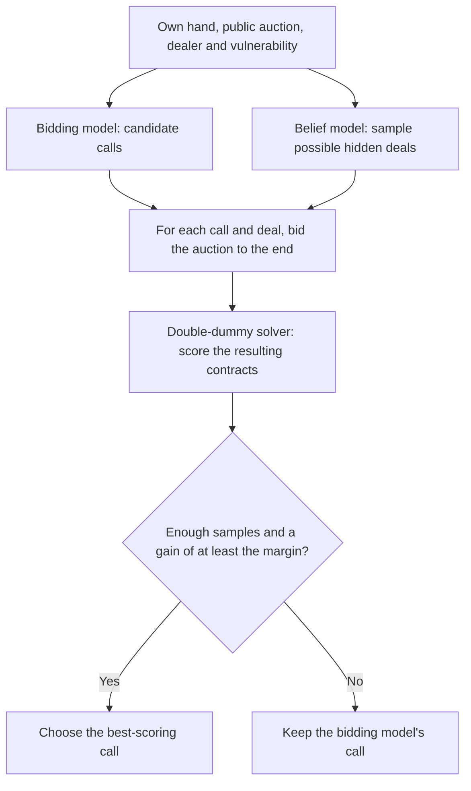

# Belief model for bidding search

Given one player's hand, vulnerability, and the auction so far, this model estimates
which opponent or partner holds each unseen card. It also estimates each hidden hand's
high-card points and suit lengths. Pidgin V2 samples possible deals from these
estimates, then checks whether another bid performs clearly better on those deals.
See `server/emergent/bidsearch.py` for the search.

The bidding model proposes calls; the belief model proposes hidden deals.
Search compares the calls on those same sampled deals. It never receives the
real hidden hands.



Search also keeps the original call when there is only one candidate or the
auction exceeds the belief model's input limit. The default improvement margin
is 50 bridge points; settings are in `server/emergent/engine.py`.

The released checkpoint is `belief_r2.pt`. Download it with `scripts/get_models.sh`.
To ask the released Pidgin V2 bidder for a call (without bidding search):

```bash
python -m pip install -e .
python -m pip install -r server/requirements.txt
scripts/get_models.sh
python scripts/bid.py AKQ2.JT9.876.543 --auction "1H P" --model PidginV2
```

The complete team uses bidding search on the server; see [serving.md](serving.md).

## Training data and reproduction

`belief/train.py` reads auction shards from `belief/data/train/` and a complete,
fixed set of pairwise test shards from `belief/data/test/`. It rebuilds hands from
`data/dds_results_100M.npy` (see the [README](../README.md#training-data)). The
committed `belief/data/systems.json` records bidder IDs used in those shards; it
is a data schema, not a list of models supplied by this repository. Its `D75` ID
means Pidgin V1's bidding checkpoint. Other old IDs remain because changing them
would mislabel saved data; they are not needed to use the released team.

The auction generator, `belief/gen.py`, is **not independently runnable from this
checkout**. It imports `match` from an external `BRIDGE_LAB` checkout and points to
additional bidder checkpoints under `BRIDGE_KEEP`, plus EPBot and WBridge5 data.
Neither those sources nor the generated shards are included here. The released
belief checkpoint can be used without them. To reproduce training, first supply
the external bidders and compatible auction shards. `--no-wb5` removes only the
WBridge5 training input: the test loader still requires the WBridge5 test file
and all 120 original pair files.

Once those inputs exist, the historical training sequence is:

```bash
python -u belief/train.py --out runs/belief/r0 --steps 100000 --lr 3e-4 --d 1024 --layers 4 \
  --holdout ep_wj,E28 --wb5-frac 0.2 --reload 2000
python -u belief/train.py --out runs/belief/r2 --init runs/belief/r0/last.pt --steps 30000 \
  --lr 1e-4 --d 1024 --layers 4 --summary --sum-weight 0.3 \
  --holdout ep_wj,E28 --wb5-frac 0.2 --reload 1000000
```

The first run learns card locations; the second adds point and suit-length
predictions. `--holdout` uses exact system IDs from `systems.json` and excludes
those bidders from training. These commands describe the original settings;
they require the missing auction data and bidders. Use `--device cpu`,
`--device mps`, or `--device cuda` as available.
