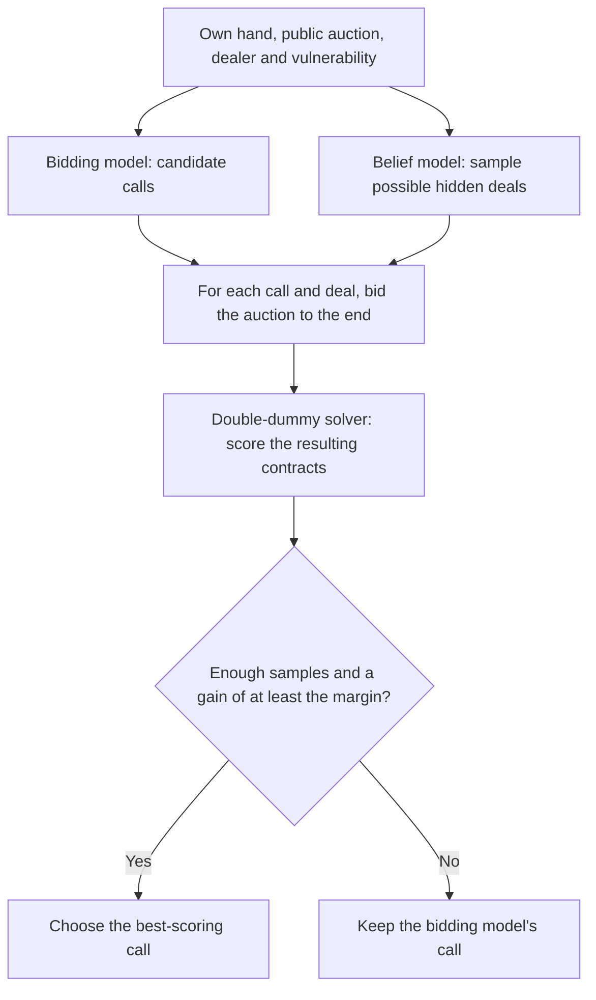
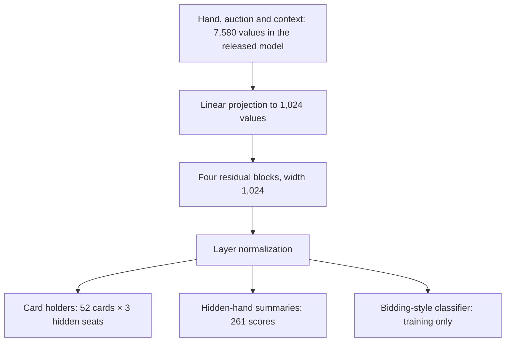

# Belief model for bidding search

Given one player's hand, vulnerability, and the auction so far, this model estimates
which opponent or partner holds each unseen card. It also estimates each hidden hand's
high-card points and suit lengths. Pidgin V2 samples possible deals from these
estimates, then checks whether another bid performs clearly better on those deals.
See `server/emergent/bidsearch.py` for the search.

The bidding model proposes calls; the belief model proposes hidden deals.
Search compares the calls on those same sampled deals. It never receives the
real hidden hands.



Search also keeps the original call when there is only one candidate or the
auction exceeds the belief model's input limit. The default improvement margin
is 50 bridge points; settings are in `server/emergent/engine.py`.

## Network and outputs

The released model is a multilayer perceptron (MLP), not a transformer. Its
input is the viewer's 52-card ownership mask, two vulnerability flags (our side
and theirs), the dealer's seat relative to the viewer, two optional bidder-system
IDs, and the auction. An auction can have at most 48 calls. Each call occupies a
slot for its position, caller's relative seat, and call (`1C` through `7NT`,
pass, double, or redouble). This makes a mostly empty 7,580-value input in the
released checkpoint. During search, both system IDs are set to “unknown.”

| Part | Released layout | Purpose |
|---|---|---|
| Shared network | 1,024-value input projection, then four residual blocks with layer normalization, linear layers and GELU, then final normalization | Combines hand and auction evidence |
| Card-owner head | 52 × 3 scores | For each card, estimates left-hand opponent, partner, or right-hand opponent; the viewer's 13 cards are ignored |
| Summary head | Three hands × (31 high-card-point bins + four suits × 14 length bins) | Estimates points and each suit's length for each hidden hand |

The training model also has a head to guess the two bidder-system IDs. The
released server checkpoint omits that head because search does not use it.
The width of the input depends on the number of bidding styles represented
in the training data; the checkpoint records that count.



## What training minimizes

The main loss is cross-entropy for the holder of each of the 39 unseen cards.
The viewer's own cards do not count. Each side's system ID is independently
hidden half the time; when hidden, a system-classification loss teaches the
network to infer it from the auction. Training adds that loss at weight 0.1.
The second stage adds high-card-point and suit-length classification losses
for the three hidden hands, together at weight 0.3. It starts from the first
stage's weights; the new summary head starts untrained.

For each training row, the trainer chooses a viewer and an auction prefix,
using the full auction half the time. In simplified pseudocode:

```text
load auction shards and the corresponding dealt hands
for each training step:
    sample auctions, including a fixed share from WBridge5 data
    choose a viewer and an auction prefix for each auction
    hide each partnership's system ID independently with probability 0.5
    predict unseen-card holders and bidder systems
    loss = card-holder cross-entropy + 0.1 × hidden-system cross-entropy
    if training stage 2:
        loss += 0.3 × (high-card-point loss + suit-length loss)
    update the network; periodically evaluate full auctions and save a checkpoint
```

For evaluation and search, an iterative normalization called Sinkhorn adjusts
the card-owner probabilities so each hidden seat is expected to hold 13 cards.
This adjustment is not part of the training loss. Search then samples complete
deals using the adjusted card probabilities and summary predictions.

## Results

20,000 held-out auctions from many bidders, read from all four seats
([all results](results.md#belief-net)):

| Calls heard | Hidden cards placed right | HCP error per hand | Suit length error |
|---|---|---|---|
| 0 | 33.3% | 3.12 | 1.03 |
| 4 | 42.8% | 2.15 | 0.83 |
| full auction | 44.8% | 1.78 | 0.71 |

A guesser told every hidden hand's exact suit lengths places 47.1%. Most of the
information arrives in the first four calls.

## Training history


Held-out card placement improves through the card-owner stage and holds through the
hand-summary fine-tune. The bottom row shows the released model by auction length and
card rank. See [training curves](training_curves.md).

The released checkpoint is `belief_r2.pt`. Download it with `scripts/get_models.sh`.
To ask the released Pidgin V2 bidder for a call (without bidding search):

```bash
python -m pip install -e .
python -m pip install -r server/requirements.txt
scripts/get_models.sh
python scripts/bid.py AKQ2.JT9.876.543 --auction "1H P" --model PidginV2
```

The complete team uses bidding search on the server; see [serving.md](serving.md).

## Train a belief model

Training needs completed auctions, the dealt hands, and labels identifying the
bidding style of each partnership. Use separate auctions for training and
validation so the model is tested on deals it has not learned from.

The trainer reads auction shards from `belief/data/train/` and pairwise test
shards from `belief/data/test/`, with style labels listed in
`belief/data/systems.json`. It rebuilds hands from the DDS dataset described in
the [README](../README.md#training-data).

Generate the shards with `belief/gen.py` (see above), then train in two runs:

```bash
python -u belief/train.py --out runs/belief/card_owners \
  --steps 100000 --lr 3e-4 --d 1024 --layers 4 --wb5-frac 0.2 --reload 2000
python -u belief/train.py --out runs/belief/hand_summary \
  --init runs/belief/card_owners/last.pt --steps 30000 \
  --lr 1e-4 --d 1024 --layers 4 --summary --sum-weight 0.3 \
  --wb5-frac 0.2 --reload 1000000
```

The first run learns card locations; the second adds point and suit-length
predictions. `--holdout` can exclude selected style labels from training. Use
`--device cpu`, `--device mps`, or `--device cuda` as available.
