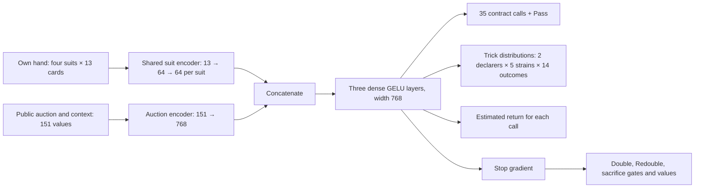

# How the bidding model learns

This page explains the network shared by the [Pidgin V1](pidgin_v1.md) and
[Pidgin V2](pidgin_v2.md) bidding recipes. It describes the implementation in
`training/contract/model.py`, `training/ground.py`,
`training/fourseat/model.py`, `training/fourseat/competitive.py`, and
`training/fourseat/train.py`. Both released bidding checkpoints record a
768-unit width, 64-unit suit encoders, and three trunk layers in `model_config`.

## What the bidder sees

At each turn, the bidder sees its 13 cards, the public auction, dealer position,
and its partnership's vulnerability. The auction is encoded relative to the
player whose turn it is: which bids each seat has made, whether either partner
passed before their first bid, and whether the standing contract is doubled or
redoubled. It never sees the other three hands or the double-dummy trick table.
The released model's public-auction vector has 151 entries: 77 for the original
partnership view, 70 for opponents' bids, and four for doubling and end-of-auction
state. The hand is four 13-card suit vectors.



The first training stage has 36 calls: 35 contracts and Pass. In four-seat
training, legal Double and Redouble actions are added. The released network
routes part of Pass's probability through learned gates for Double, Redouble,
or a higher-level sacrifice bid when those choices are legal. Illegal calls
are masked out. The special-action heads read a detached copy of the trunk, so
their losses cannot change the shared representation. The ordinary call head,
trick head, and call-value head can train the trunk.

Training also uses a separate **critic** to estimate the final reward. It sees
both hands in the acting partnership and the public auction. Its output is a
baseline for learning, not a value the deployed bidder receives. The code saves
critic settings in checkpoints, but the serving path makes bids from the actor.

## Grounding losses

Grounding samples partial auctions where the opponents must Pass. For each
legal call, the double-dummy table supplies the score if everyone subsequently
passes. The net learns three targets:

| Output | Target | Loss |
|---|---|---|
| Trick distribution | Exact trick count for either partner declaring each strain | Cross-entropy over 0–13 tricks. |
| Call value | Exact endpoint score minus the best possible partnership score on that deal, divided by 100 | Huber loss on legal calls. |
| Call policy | Softmax of endpoint values predicted by a periodically copied target net | Cross-entropy with that fixed distribution. |

The combined grounding loss is `trick_nll + q_loss + 0.5 × policy_loss` with
the public recipe's default weights. The target net is copied from the actor
every 100 updates; its outputs are detached when constructing the policy target.
The double-dummy table creates training targets and is never a bidder input.
Grounding selects `best.pt` by the mean score of greedy auctions against silent
opponents on validation deals.

```text
initialize the actor and a frozen copy used for targets
for each grounding step:
    sample hands and partial auctions with opponents passing
    use the trick table to calculate legal-call scores
    use the frozen copy's values to form a target call distribution
    update the actor on trick, call-value, and policy losses
    refresh the frozen copy every 100 steps
    periodically validate greedy auctions and save the best checkpoint
```

## Four-seat self-play losses

After grounding, one shared actor bids all four seats. Some training deals force
one partnership to Pass; other deals let both partnerships bid. A frozen league
or fixed opponent can replace one side in later stages. Each decision gets the
final reward for its own side, with no discount across auction calls.

An **own-contract** reward scores each partnership's highest bid as an
undoubled contract, even if the opponents won the auction. The **table** reward
scores the actual final contract from that side's view, including penalties
for failed, doubled, or redoubled contracts. Training mixes the two according
to `--table-weight`: zero means own-contract reward, one means table reward.
From either reward, the trainer subtracts that side's best possible
double-dummy partnership score and divides by 100. This centers the target
in units of 100 score points. It does not make the training reward an IMP score;
paired IMPs are used later for checkpoint selection.

The actor's main update increases the log probability of sampled calls when
the final reward exceeds the critic's estimate and decreases it otherwise.
An entropy bonus encourages exploration. It also trains the selected call's
value with squared error and the trick distribution with cross-entropy. The
critic separately minimizes squared error against the final reward. The critic
prediction is detached from the actor's advantage, and its optimizer is
separate. The default four-seat weights are `0.5` for call-value loss, `0.2`
for trick loss, and `0.01` for the entropy bonus.

Double, Redouble, and sacrifice each have value heads trained against exact
counterfactual scores from the deal's double-dummy table. Their gates may also
learn from those value heads through binary cross-entropy. In the final V1 and
V2 stages, the gate cross-entropy weights are zero: the gates receive policy
gradient through sampled outcomes (`--gate-pg`), while the value heads still
receive their squared-error losses. The gates and value heads cannot update the
shared trunk because they read its detached output. A code-word cost of `0.2`
is subtracted only from the advantage of calls flagged by the repository's
[simplicity rule](../README.md#simplicity). V2's last stage similarly subtracts
`0.5` for weak openings. These costs affect policy learning; they do not alter
the critic or call-value targets.

For the final table-score stages, the default combined loss is:

```text
actor = policy_gradient - 0.01 × entropy
        + 0.5 × call_value_MSE + 0.2 × trick_cross_entropy
        + 0.5 × (double_value_MSE + redouble_value_MSE + sacrifice_value_MSE)
critic = mean((predicted_reward - final_reward)²)
```

During own-contract stages, special actions can also receive credit for their
score change. That extra credit decreases as table reward takes over, reaching
zero at table weight 1 because the final score already includes those actions.

In simplified pseudocode, one update is:

```text
load a block of deals and double-dummy results
sample auctions with the current actor; optionally use a frozen opponent
for each decision made by the learning actor:
    compute the side's final reward and the critic's baseline
    subtract any simplicity or weak-opening cost from this call's advantage
    gather exact trick, selected-call value, and special-action targets
update the actor from policy gradient + entropy + supervised auxiliary losses
update the separate critic from squared error against the final reward
periodically evaluate greedy bidding and save an accepted checkpoint
```

This is a description of the training logic, not a standalone reproduction
command. The V1 and V2 guides give their stage settings, inputs, and limits.
