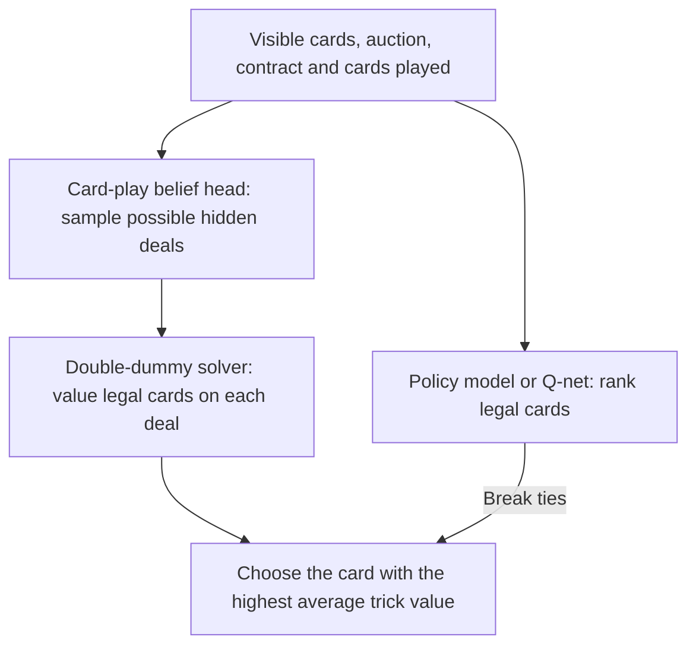
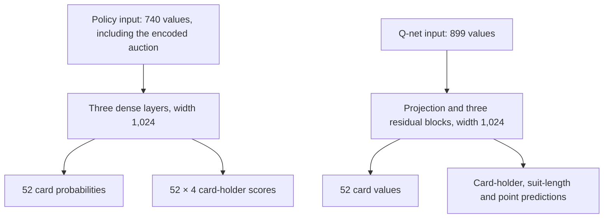

# Card play

The released teams use two kinds of card-play model. A **policy model** picks a
card directly and learns through self-play. A **Q-net** estimates the value of
each legal card from double-dummy solver results. On the site, both use search:
they sample possible hidden deals, solve them, and pick the card with the best
average result. See `training/play/search.py` and `server/emergent/engine.py`.

| Public name | Released filename | Used by |
|---|---|---|
| Pidgin V1 card play | `play_E48_wideleagueH.pt` | Pidgin V1; also samples hidden deals for the Q-net. |
| Compact self-play card-play model | `play_E48_leagueE.pt` | Alternative in the site's debug view. |
| Pidgin Q-net card play | `play_B2g_s540k.pt` | Pidgin V2 and BRL. |

With search enabled for the current move, card selection follows this path:



The Q-net uses the Pidgin V1 card-play model's belief head to sample deals.
This is separate from the [bidding belief model](belief.md). When search is off
or does not apply to a move, the card-play model chooses directly. Search works
with guessed hidden deals, not the opponents' actual hands.

## What the models see

Both models describe the position from the player making the decision. They see
their own cards, dummy after the opening lead, the cards already played, the
contract, vulnerability, and auction. Declarer chooses cards for dummy too.
Neither model receives the hidden hands when it makes a move.

| Model | Position encoding and network | Outputs |
|---|---|---|
| Pidgin V1 policy model | 740 numbers: card ownership and play history, contract and score state, calls made by each seat, and a 96-number reading of the ordered auction. A three-layer fully connected network uses width 1,024 in the released V1 model (512 in the compact model). The auction reader embeds each call and its caller, then runs a GRU once per deal. | A probability for each of 52 cards, with illegal cards masked out; and 52 × 4 scores for which seat holds each card. |
| Pidgin Q-net | 899 numbers: visible and played cards, trick position, contract and score state, calls made by each seat, the last six calls, and dealer position. The released checkpoint has a width-1,024, three-block residual network. | One predicted trick-value difference for each of 52 cards. Auxiliary heads output 52 × 4 card-owner scores, 4 × 4 × 14 suit-length scores, and 4 × 38 high-card-point scores; serving uses its card values. |

The policy trainer also has a **critic** with a separate 384-number input that
includes all four hands. It estimates tricks the side on turn will still win and
reduces noise in the policy update. The critic is never used when playing a board.
The Q-net has no critic. Its optional `--belief` mode appends 171 features from a
separate bidding belief model; the released Q-net has the standard 899 inputs and
does not use that mode. See
[`training/play/model.py`](../training/play/model.py),
[`qnet/train_play.py`](../qnet/train_play.py), and
[`server/emergent/playq.py`](../server/emergent/playq.py).



## How the policy model learns

The policy trainer plays complete deals against itself or frozen earlier
snapshots. After each deal, it counts how many tricks the acting side won from
each decision onward. That return trains the card policy. The known dealt hands
provide labels for the hidden-card head; the double-dummy table is used for
evaluation only.

For each learner decision, the loss in
[`training/play/train.py`](../training/play/train.py) is:

```text
policy = -mean(normalized_advantage × log_probability(chosen_card))
critic = mean((predicted_remaining_tricks - actual_remaining_tricks)²)
belief = cross_entropy(hidden_card_owner, over unseen and unplayed cards)
total = policy + 0.5 × critic + belief_weight × belief - 0.01 × policy_entropy
```

The advantage is actual remaining tricks minus the critic's prediction, then
standardized across learner decisions in the batch. Only decisions made by the
learning partnership enter these losses when an older snapshot plays the other
side. The default belief weight is 1.0; `--belief-final` can lower it linearly
over the first half of the run (the V1 league example below ends at 0.1).
With `--group K`, the trainer instead plays each deal K times and compares each
result with the mean of its other copies; the critic loss is then zero.

```text
load deals, auctions, contracts, and held-out deals
for each training step:
    sample deals; optionally choose a frozen opponent
    play all 52 cards, sampling legal cards from each side's model
    for each learner move, compute remaining tricks and hidden-card labels
    estimate advantage with the critic (or other copies of the same deal)
    update the policy, critic, and hidden-card head with the total loss
    periodically evaluate on held-out deals and save a checkpoint
```

## How the Q-net learns

The Q-net's data generator plays out auctions with the Pidgin V1 policy model.
At every card position, a double-dummy solver evaluates **every legal card**.
Training positions include some random legal moves, so the model sees positions
outside the policy model's usual path. For a legal card, the target is its solver
trick count for the side on turn **minus the best legal card's count**: 0 is best,
and a negative value is tricks lost. Illegal cards are excluded from the loss.

The trainer's default loss is the mean squared error of these targets over legal
cards. With `--bhead`, it also predicts each hidden card's owner, each hidden
hand's original suit lengths, and high-card points. Its actual combined loss is:

```text
Q = mean((predicted_value - solver_value_relative_to_best)², legal cards only)
card = cross_entropy(hidden_card_owner, hidden unplayed cards only)
summary = mean_suit_length_cross_entropy + high_card_point_cross_entropy
total = Q + 0.1 × (card + 0.25 × summary)
```

The owner head excludes seats the player can already see. The summary losses
cover hidden seats only. The released Q-net was trained with this auxiliary head,
but serving uses the Pidgin V1 policy model's belief head to sample hidden deals
for search. This keeps the Q-net's value predictions and the deal sampler as
separate roles.

```text
generate auctions and play each deal with the policy model
at each of 52 positions, solve every legal card and save its trick value
for each training step:
    sample a saved position and build the player's visible 899-number input
    set legal-card targets relative to the best solver value
    update the residual Q-net on legal-card error and hidden-hand labels
    periodically measure card choices on held-out positions and save a checkpoint
```

The released `play_B2g_s540k.pt` records step 540,000, input size 899, width
1,024, and depth 3. The commands below train the same kind of model.

## Results

Opening leads on 5,000 benchmark contracts, every legal lead solved double dummy
([all results](results.md#opening-leads)). DDOLAR: share of leads that give up no trick;
ADDOLAR: the same without deals where every lead gives the same result.

| Lead | DDOLAR | ADDOLAR |
|---|---|---|
| policy net (Pidgin V1 team) | 76.5 ± 0.6% | 68.2 ± 0.8% |
| Q-net (Pidgin V2 and BRL teams) | 81.3 ± 0.6% | 74.7 ± 0.7% |
| top human experts (Hammond) | about 81% | about 74.7% |

Declarer play, 49,927 benchmark boards, IMPs per board: policy net vs random cards
+6.30 ± 0.03, vs the earlier policy net +0.44 ± 0.02. Q-net vs policy net, plain nets:
+0.93 ± 0.07 (5,990 boards); with PIMC search on both sides: +0.05 ± 0.06.

## Training history


The policy net learns most of its declarer and defence play in the first 10,000
self-play steps. The Q-net beats the policy net's double-dummy accuracy at every
position type. See [training curves](training_curves.md).

Download the released models with
`scripts/get_models.sh`. To compare the Pidgin V1 policy model with random legal
play on the published benchmark (without search):

```bash
python -m pip install -e .
python -m pip install -r server/requirements.txt
scripts/get_models.sh
python -m training.play.match server/models/bench_100k.npz \
  --challenger server/models/play_E48_wideleagueH.pt \
  --reference random --deals 100
```

This command evaluates direct policy decisions. The site also runs search,
which can change the result.

## Train the policy model

The trainer is `training/play/train.py`. It needs auctions paired with hands and
double-dummy trick tables. Download `data/dds_results_100M.npy` as shown in the
[README](../README.md#training-data), then generate sampled Pidgin V1 auctions:

```bash
python -m pip install -r server/requirements.txt
mkdir -p data/play
python scripts/generate_auctions.py --model PidginV1 --n 1000000 \
  --temperature 1,3,5 --data data/dds_results_100M.npy --start 0 \
  --out data/play/auctions_1M.npz
```

The policy trainer supports two example model widths. The compact model uses
the first pair; Pidgin V1 card play uses the second. Each second run starts from
the matching first run and plays against a pool of past snapshots:

```bash
python -m training.play.train data/play/auctions_1M.npz \
  --out runs/play/compact_base --width 512 --batch 512 --steps 25000
python -m training.play.train data/play/auctions_1M.npz \
  --out runs/play/compact_league --init runs/play/compact_base/last.pt \
  --width 512 --pool-size 5 --steps 20000
python -m training.play.train data/play/auctions_1M.npz \
  --out runs/play/v1_base --width 1024 --batch 512 --steps 25000
python -m training.play.train data/play/auctions_1M.npz \
  --out runs/play/v1_league --init runs/play/v1_base/last.pt \
  --width 1024 --pool-size 5 --belief-final 0.1 --steps 20000
```

Both examples train a base policy for 25,000 steps, then fine-tune it against
earlier checkpoints for 20,000 steps. Use validation matches to decide whether
a longer run helps.

## Train the Q-net

The Q-net learns solver values for every legal card. Its data pipeline first
generates Pidgin V1 auctions, then plays each deal with the policy model and
solves each legal card. It requires the full DDS dataset, the released Pidgin V1
bidder and card-play model, and the `endplay` package for double-dummy solving.
From the repository root:

```bash
python -m pip install endplay
scripts/get_models.sh
bash qnet/make_auc.sh
bash qnet/worker.sh
python qnet/train_play.py --run values --steps 10000
python qnet/train_play.py --run belief --bhead \
  --init runs/play_q/values/last.pt --steps 10000
python qnet/train_play.py --run refined --bhead \
  --init runs/play_q/belief/last.pt --device cuda --steps 10000
```

`make_auc.sh` writes auction files under `qnet/auc/`; `worker.sh` writes solved
positions under `qnet/pos/`. The worker can be run in several processes and
exits when all current auctions are processed. `--device cuda` requires a CUDA
GPU; choose `--device cpu` when one is unavailable. The 10,000-step values above
are an example, not the released training duration. The published Q-net is a
checkpoint from the final stage at step 540,000.
