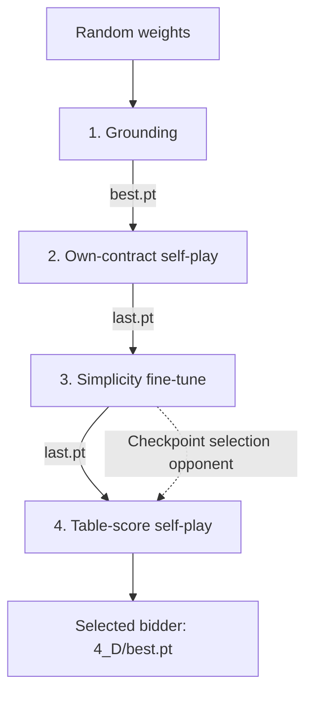

# Pidgin V1 bidding

Pidgin V1 learns to bid from dealt hands and double-dummy trick results, without
expert auction examples. Its released bidder is `D_cw_s75k.pt`; the Pidgin V1 bidding checkpoint at training step 75,000.
The complete team uses the card-play model described in
[card_play.md](card_play.md).
The [bidding model guide](bidding_model.md) explains the network layout,
losses, and a training-loop example shared with V2.

To try the released team, install the package, download the models, and ask it
for one call. Hand suits are written spades.hearts.diamonds.clubs:

```bash
python -m pip install -e .
python -m pip install -r server/requirements.txt
scripts/get_models.sh
python scripts/bid.py AKQ2.JT9.876.543 --auction "1H P" --model PidginV1
```

## Train a new bidder

The public training recipe needs `data/dds_results_100M.npy`; the
[README](../README.md#training-data) shows where to get it. From the repository
root, run:

```bash
./train.sh runs/my_v1
```

For a quick pipeline check with the included small fixture, run
`./train.sh --smoke runs/smoke`. This tests the stages, but does not produce a
competitive bidder. The full recipe trains on CPU. `THREADS=8 ./train.sh
runs/my_v1` sets its CPU thread count.

| Stage | Output | Purpose |
|---|---|---|
| Grounding | `1_ground/best.pt` | Learn tricks and contract value from double-dummy results. |
| Own-contract play | `2_own/last.pt` | Bid all four seats; reward each partnership's own contract. |
| Simplicity | `3_simple/last.pt` | Continue training with a small cost for calls flagged by the repository's [code-word rule](../README.md#simplicity). |
| Table score | `4_D/best.pt` | Learn from the final contract's table score and select a checkpoint by paired IMPs against stage 3. |

The arrows show which saved weights start the next stage. The dashed arrow is
an evaluation opponent, not a source of training examples.



The script writes the final selected checkpoint to `runs/my_v1/4_D/best.pt`.
The recipe trains a comparable Pidgin V1 bidder and selects it against the
stage 3 checkpoint. Results vary with the training seed.

## Results

Bidding alone, duplicate, double-dummy scoring, IMPs per board on 160,000 held-out
boards unless noted ([all results](results.md)):

| Opponent | IMPs/board |
|---|---|
| `rule:sayc` (this repo's rule bidder) | +3.18 ± 0.05 |
| BRL (Kita et al. 2024) | −0.38 ± 0.03 |
| EPBot, five convention cards (8,000 boards each) | +0.62 to +0.73 |
| Pidgin V2 | −0.37 ± 0.03 |
| punisher (doubles every contract that goes down) | −1.79 ± 0.03 |

Style: 0.92 code words per 100 calls; 4.4% of 0–7 HCP hands open; no weak twos
(seat 1, not vulnerable: 7+ spades and at most 10 HCP opens 1♠ 94% of the time).

## Training history


Grounding and own-contract play raise the contract score to about 150 points per deal.
The simplicity stage halves the code words. Table score then trades some own-contract
score for IMPs against the selection opponent. See [training curves](training_curves.md).

Completed stages are skipped if you rerun the same output directory. Use a new
directory when changing settings. The [README](../README.md#train-pidgin-v1) explains
the data splits, resume behavior, and stage settings.
