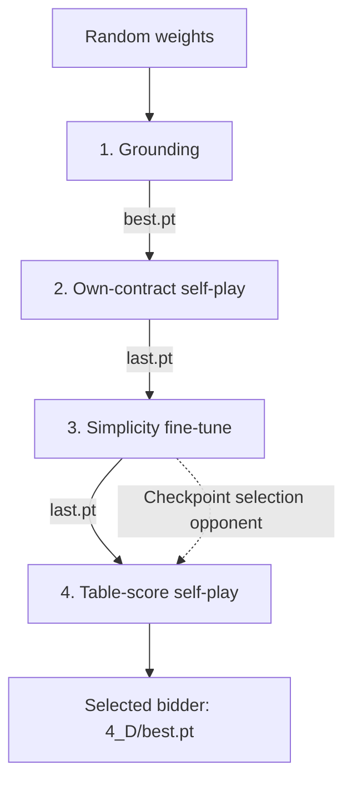

# Pidgin V1 bidding

Pidgin V1 learns to bid from dealt hands and double-dummy trick results, without
expert auction examples. Its released bidder is `D_cw_s75k.pt`; the Pidgin V1 bidding checkpoint at training step 75,000.
The complete team uses the card-play model described in
[card_play.md](card_play.md).
The [bidding model guide](bidding_model.md) explains the network layout,
losses, and a training-loop example shared with V2.

To try the released team, install the package, download the models, and ask it
for one call. Hand suits are written spades.hearts.diamonds.clubs:

```bash
python -m pip install -e .
python -m pip install -r server/requirements.txt
scripts/get_models.sh
python scripts/bid.py AKQ2.JT9.876.543 --auction "1H P" --model PidginV1
```

## Train a new bidder

The public training recipe needs `data/dds_results_100M.npy`; the
[README](../README.md#training-data) shows where to get it. From the repository
root, run:

```bash
./train.sh runs/my_v1
```

For a quick pipeline check with the included small fixture, run
`./train.sh --smoke runs/smoke`. This tests the stages, but does not produce a
competitive bidder. The full recipe trains on CPU. `THREADS=8 ./train.sh
runs/my_v1` sets its CPU thread count.

| Stage | Output | Purpose |
|---|---|---|
| Grounding | `1_ground/best.pt` | Learn tricks and contract value from double-dummy results. |
| Own-contract play | `2_own/last.pt` | Bid all four seats; reward each partnership's own contract. |
| Simplicity | `3_simple/last.pt` | Continue training with a small cost for calls flagged by the repository's [code-word rule](../README.md#simplicity). |
| Table score | `4_D/best.pt` | Learn from the final contract's table score and select a checkpoint by paired IMPs against stage 3. |

The arrows show which saved weights start the next stage. The dashed arrow is
an evaluation opponent, not a source of training examples.



The script writes the final selected checkpoint to `runs/my_v1/4_D/best.pt`.
The recipe trains a comparable Pidgin V1 bidder and selects it against the
stage 3 checkpoint. Results vary with the training seed.

## Training history


The first panel shows training error when predicting a call's reward, measured
in units of 100 bridge points. The second counts calls flagged by the
[simplicity rule](../README.md#simplicity) per 100 validation auctions. Both follow
the final table-score stage, which starts from a pretrained bidder. Lower loss
or fewer flagged calls alone does not establish stronger play; see
[results](results.md) for match performance and [training curves](training_curves.md)
for the plotted data.

Completed stages are skipped if you rerun the same output directory. Use a new
directory when changing settings. The [README](../README.md#train-pidgin-v1) explains
the data splits, resume behavior, and stage settings.
