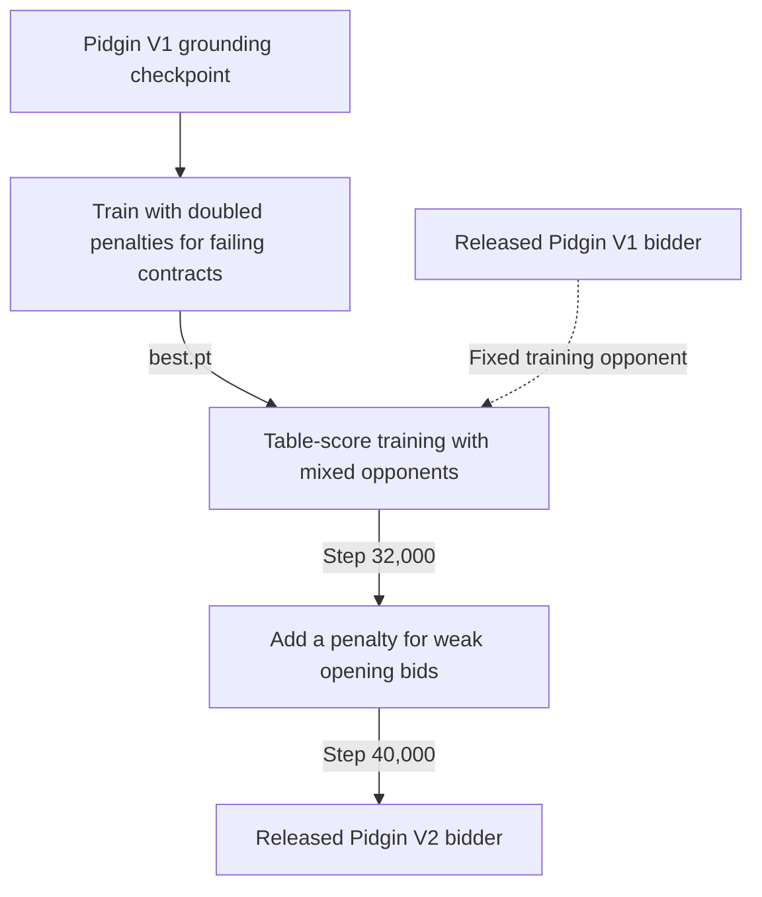

# Pidgin V2 bidding

Pidgin V2's released bidder is `pidginv2_bid_s40000.pt`. The complete team also
uses [belief-based bidding search](belief.md) and the
[Pidgin Q-net card-play model](card_play.md). Its training starts with Pidgin V1's
grounding stage, then trains on table score. Later stages add a stronger penalty
for contracts that fail when doubled and a cost for weak opening bids.
The [bidding model guide](bidding_model.md) explains the network layout,
losses, and a training-loop example shared with V1.

To ask the released Pidgin V2 bidder for a call without bidding search:

```bash
python -m pip install -e .
python -m pip install -r server/requirements.txt
scripts/get_models.sh
python scripts/bid.py AKQ2.JT9.876.543 --auction "1H P" --model PidginV2
```

The complete team uses bidding search and card play on the server; see
[serving.md](serving.md).

## Training outline

Pidgin V2 branches from Pidgin V1's grounding stage, before own-contract training.
The released Pidgin V1 bidder is a separate opponent for training and evaluation.



The trainer is `training/fourseat/train.py`. It needs the
`data/dds_results_100M.npy` dataset (see [README](../README.md#training-data)),
Pidgin V1's grounding checkpoint, and the released Pidgin V1 bidder as a fixed
opponent. Generate a grounding checkpoint with `./train.sh runs/my_v1`, or use
one from a previous run. Download Pidgin V1's bidder with
`scripts/get_models.sh`. The common settings for each V2 stage are:

```text
--data data/dds_results_100M.npy --episodes 2048
--val-start 3028000 --val-count 5000 --eval-start -10000 --eval-count 10000
--train-pool-start 3033000 --train-pool-end 99990000 --train-block-size 1000000
--train-block-every 2000 --silent-frac 0.25 --snapshot-every 1000 --patience 0
--select imp --imp-opponent server/models/D_cw_s75k.pt
--table-weight 1 --code-word-penalty 0.2
```

`D_cw_s75k.pt` is Pidgin V1's existing checkpoint filename. Pass its full path
wherever `--fixed-opponents` is needed too.

| Stage | Start from | Main change |
|---|---|---|
| Grounding | Random weights | Reuse Pidgin V1's `1_ground/best.pt`. |
| Doubled-failure training | Grounding | Treat a failing contract as doubled when calculating the reward. |
| Table play | Previous stage's `best.pt` | Add a league of past selves, a perfect-information punisher, and Pidgin V1 as a fixed opponent. |
| Light-opening cost | Table-play checkpoint at step 32,000 | Add `--light-open-penalty 0.5` to discourage weak opening bids. |

For example, stage 2 starts as follows once the dataset, grounding checkpoint,
and V1 model are in place:

```bash
python -m training.fourseat.train --out runs/my_v2/2_doubling \
  --init runs/my_v1/1_ground/best.pt --data data/dds_results_100M.npy \
  --episodes 2048 --val-start 3028000 --val-count 5000 \
  --eval-start -10000 --eval-count 10000 --train-pool-start 3033000 \
  --train-pool-end 99990000 --train-block-size 1000000 \
  --train-block-every 2000 --silent-frac 0.25 --snapshot-every 1000 \
  --patience 0 --select imp --imp-opponent server/models/D_cw_s75k.pt \
  --table-weight 1 --code-word-penalty 0.2 --table-down-doubled own \
  --pg-lr 3e-4 --steps 40000 --eval-every 2000 \
  --max-level5-rise 0.15 --max-double-rate 0.6
```

For stage 3, start from stage 2's selected checkpoint. The additional opponents
are a league of past checkpoints, a perfect-information punisher that doubles
failing contracts, and the fixed Pidgin V1 bidder:

```bash
python -m training.fourseat.train --out runs/my_v2/3_table \
  --init runs/my_v2/2_doubling/best.pt --data data/dds_results_100M.npy \
  --episodes 2048 --val-start 3028000 --val-count 5000 \
  --eval-start -10000 --eval-count 10000 --train-pool-start 3033000 \
  --train-pool-end 99990000 --train-block-size 1000000 \
  --train-block-every 2000 --silent-frac 0.25 --snapshot-every 1000 \
  --patience 0 --select imp --imp-opponent server/models/D_cw_s75k.pt \
  --table-weight 1 --code-word-penalty 0.2 \
  --pg-lr 3e-5 --critic-lr 1e-3 --double-tau 0.1 --xx-tau 0.1 --sac-tau 0.5 \
  --double-value-lr 3e-5 --xx-value-lr 3e-5 --sac-value-lr 3e-5 \
  --double-cf-weight 0 --xx-cf-weight 0 --sac-cf-weight 0 --gate-pg \
  --any-seat-double --league-frac 0.2 --league-every 1000 \
  --punisher-frac 0.4 --punisher-miss 0 --punisher-refresh 1000 \
  --fixed-frac 0.2 --fixed-opponents server/models/D_cw_s75k.pt \
  --steps 60000 --eval-every 2000 --max-level5-rise 1 \
  --max-sac-rate 0.2 --max-double-rate 0.4
```

Stage 4 starts from `runs/my_v2/3_table/ckpt_step32000.pt`, uses the stage 3
flags, and adds `--light-open-penalty 0.5`. Set a new `--out` directory and
`--steps 40000` to reach the released checkpoint's step count. The released file is the step 40,000
checkpoint.

## Results

Bidding alone, duplicate, double-dummy scoring, 160,000 held-out boards
([all results](results.md)):

| Opponent | IMPs/board |
|---|---|
| Pidgin V1 | +0.37 ± 0.03 |
| `rule:sayc` (this repo's rule bidder) | +3.39 ± 0.05 |
| punisher (doubles every contract that goes down) | +0.00 ± 0.03 |

Full team (bidding search and Q-net card play) against the Pidgin V1 team, 4,000 boards
scored on the real cards: +0.33 ± 0.10 IMPs per board.

Style compared with V1: the same 0.92 code words per 100 calls; weak two-bids in all four
suits; 1♠ shows five cards 91% of the time (V1: 66%); 6.5% of 0–7 HCP hands open (V1: 4.4%).

## Training history


IMPs against Pidgin V1 climb from −3.7 to about +0.35 per board over the three stages.
The light-opening cost cuts openings on 0–7 HCP from 30% to about 10%. See
[training curves](training_curves.md).
