# Training curves

One plot per measurement. A plot covers every training stage that logged the value.
The stages run end to end along the step axis. A grey line marks each stage change,
and every other stage is shaded. Each stage starts from the previous stage's weights.
A dashed black line marks the released checkpoint.

All numbers are validation or held-out measurements logged during training, except
the belief net's hand-summary loss, which comes from training batches. Faint lines
are the raw values. Where a thick line is drawn over a faint one, it is a centred
rolling mean over 3–5 logged points.

Each plot is a single SVG under `docs/figures/<model>/`.
[Redraw them](#redraw-the-figures) as PDFs for a paper.

## Pidgin V1 bidding

Four stages: grounding, own-contract self-play, the simplicity fine-tune, and
table-score self-play ([Pidgin V1](pidgin_v1.md)).

### Contract score

How many points per deal the bidder's own side scores, on validation deals. In
grounding the opponents stay silent. From the own-contract stage on, the orange line
has all four seats bidding and scores only the bidder's own contract.

<p align="center">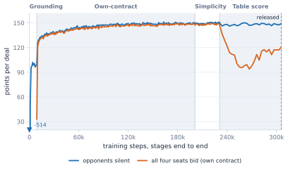</p>

Grounding takes the silent-opponent score from −514 (random weights) to about 100
points per deal within 4,000 steps. Own-contract self-play raises the four-seat score
from 33 to 126 in its first 2,000 steps and to about 148 by the end of the stage.
In the table-score stage the own-contract score drops to about 95, then recovers to
about 118. The model accepts worse contracts for its own side when that costs the
opponents more.

### Match against the selection opponent

IMPs per board against the fixed opponent that picks the released checkpoint. Only
the table-score stage plays this match.

<p align="center">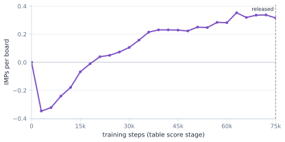</p>

The first update costs IMPs (−0.35 per board). From there the score climbs to +0.33
per board.

### Code words

Calls partner cannot read at face value, per 100 self-play auctions
([what counts](../README.md#simplicity)).

<p align="center">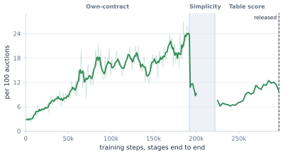</p>

Code words climb from 3 to about 22 per 100 auctions during own-contract play. The
simplicity cost brings them back to about 10, and they stay near 10 in the
table-score stage.

### Competitive calls

The share of chances the bidder takes to double, or to sacrifice (bid a contract
expected to go down, to stop the opponents' better one).

<p align="center">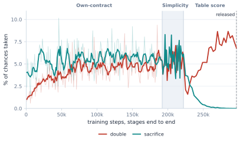</p>

In the table-score stage sacrifices fall from 4% of chances to almost none, and
doubles rise from 2% to 7–9%.

## Pidgin V2 bidding

Three stages from the Pidgin V1 grounding checkpoint: doubled failures, table play,
and the light-opening cost ([Pidgin V2](pidgin_v2.md)).

### Match against Pidgin V1

IMPs per board against the released Pidgin V1 bidder on validation deals. The
diamonds are 20,000-board matches against Pidgin V1 with a perfect-information
doubler, which doubles every contract that goes down.

<p align="center">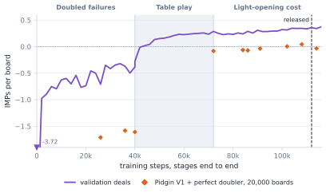</p>

The grounding checkpoint starts at −3.7 IMPs per board. Treating failed contracts as
doubled brings this to −0.4. Table play passes zero within 4,000 steps and reaches
+0.29. The light-opening stage ends at +0.36 at the released step. Against the
perfect doubler, the score improves from −1.6 to about 0.

### Contract score

Points per deal for the bidder's own side, with silent opponents (blue) and with all
four seats bidding (orange).

<p align="center">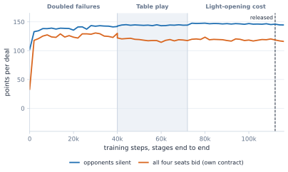</p>

The four-seat score jumps from 33 to 118 in the first 2,000 steps. After that it stays
near 120 while the IMPs keep improving.

### Light openings

The share of 0–7 HCP hands that open, in self-play auctions. Not logged in the first
stage.

<p align="center">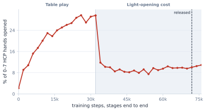</p>

Table play pushes light openings from 2% to 30%. The light-opening cost brings them
down to about 10% within 4,000 steps.

### Code words

Code words per 100 self-play auctions.

<p align="center">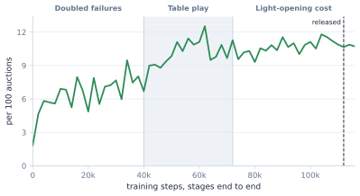</p>

They rise from 2 to about 7 per 100 auctions in the doubled-failures stage and settle
at 9–12 after that.

## Belief net

Two stages: card owners, then the hand-summary fine-tune ([belief net](belief.md)).
"Systems told" means the net is told which bidding system each side plays; "systems
hidden" means it is not.

### Card-owner loss

Cross-entropy of the net's guess of who holds each hidden card, after the full
auction, on held-out auctions. Lower is better. Random guessing is 1.099 nats.

<p align="center">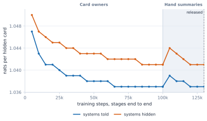</p>

The loss falls from 1.047 to 1.037 nats per hidden card. It jumps when the summary
head is added, then returns to its earlier level.

### Cards placed on the right player

The share of hidden cards whose most likely owner is the real owner, after the full
auction. Random guessing is 33%.

<p align="center">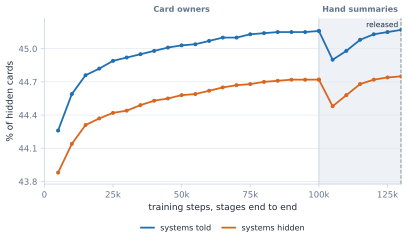</p>

Placement rises from 44.3% to 45.2%. Hiding the bidding systems costs about half a
point.

### Hand-summary loss

Loss of the summary head, which predicts each hidden hand's HCP and suit lengths.
Measured on training batches.

<p align="center">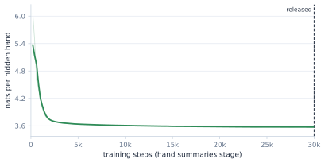</p>

The loss drops from 6.1 to 3.6 nats within 3,000 steps, then flattens.

### Released model: cards placed by auction length

The released model on 20,000 held-out auctions: the share of hidden cards placed
right after each number of calls.

<p align="center">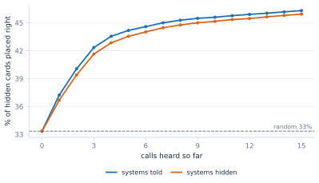</p>

Placement rises from 33% before any call to 46% after 15 calls. Most of the gain
comes in the first five calls.

### Released model: HCP error

How many HCP the net's guess is off per hidden hand, by number of calls heard.

<p align="center">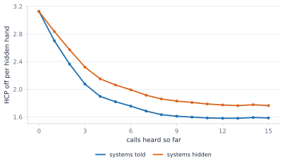</p>

The error falls from 3.1 to 1.6 HCP per hidden hand.

### Released model: aces, kings and the rest

The share of each kind of card placed on the right player, seen from the declaring
side and from the defenders.

<p align="center">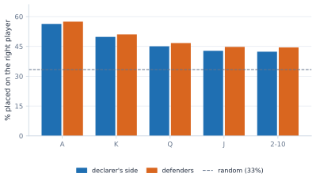</p>

Aces are placed right 56–57% of the time and spot cards 42–44%. The defenders' view is
1–2 points better than the declaring side's.

## Policy net card play

Self-play from scratch, then a league fine-tune ([card play](card_play.md)). Measured
on 19,970 held-out deals. The standard and wide networks follow the same path, and the
wide one is slightly ahead throughout.

### Declarer play

Tricks per deal the net wins as declarer, above what random card play wins.

<p align="center">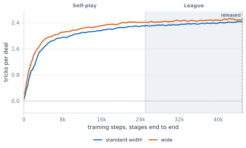</p>

The gain goes from 0 to 2.3–2.4 tricks per deal, mostly in the first 10,000 steps.
The league adds about 0.1.

### Defence

Tricks per deal the net takes back as a defender against a random declarer.

<p align="center">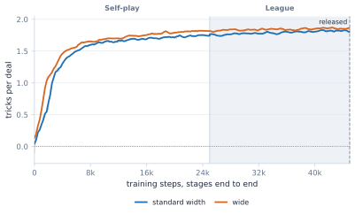</p>

The gain goes from 0 to 1.75–1.8 tricks per deal.

### Tricks below double dummy

With the net on all four seats: how many tricks per deal the result falls short of
perfect play with all hands visible.

<p align="center">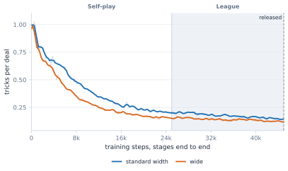</p>

The shortfall falls from 1.0 to 0.16–0.22 tricks per deal in self-play, and to
0.13–0.15 in the league.

### Belief head

Cross-entropy of the policy net's guess of who holds each hidden card.

<p align="center">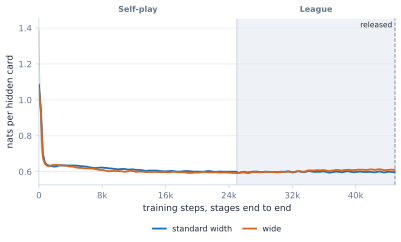</p>

It drops from 1.39 to about 0.60 nats within 1,000 steps and stays there.

## Q-net card play

Double-dummy card values, then the belief-head fine-tune ([card play](card_play.md)).
Dashed lines show the policy net on the same positions.

### Tricks lost against double dummy

Tricks lost per decision compared with the best double-dummy card, by position.

<p align="center">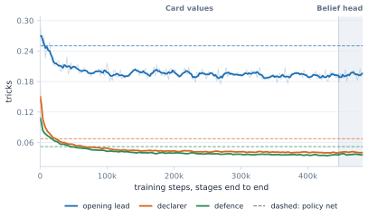</p>

Losses fall from 0.29 to 0.19 on the opening lead, 0.18 to 0.04 for declarer, and 0.12
to 0.04 in defence. The policy net loses 0.25, 0.07 and 0.05.

### Best card chosen

The share of decisions where the net picks a double-dummy best card.

<p align="center">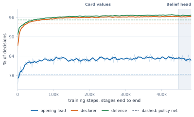</p>

The Q-net picks the best card on 83% of leads, 96% of declarer plays and 97% of
defensive plays. The policy net's rates are 78%, 94% and 95%.

### Belief head

HCP error per hidden hand of the belief head added in the second stage.

<p align="center">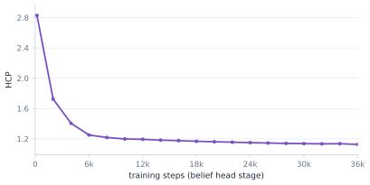</p>

The error falls from 2.8 to 1.1 HCP. Card play stays the same.

## Redraw the figures

[The numeric snapshot](data/training_curves.json) holds every plotted value, the stage
layout, and the panel settings. From the repository root, with Python 3.10 or newer:

```bash
python -m pip install matplotlib
python scripts/plot_training_curves.py
```

This writes one SVG per plot under `docs/figures/<model>/`. Add `--pdf-dir DIR` for
PDFs (for a paper) and `--preview-dir DIR` for PNG previews.
