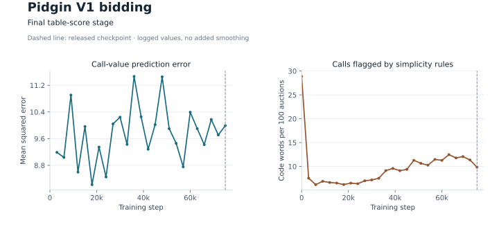
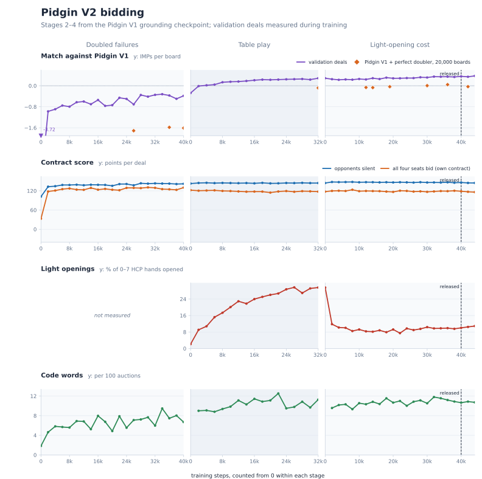
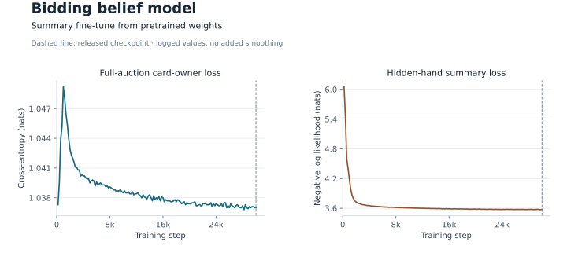
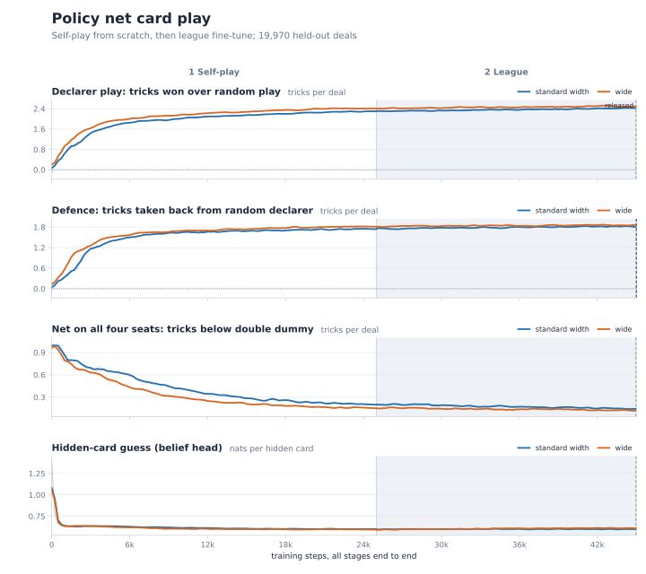
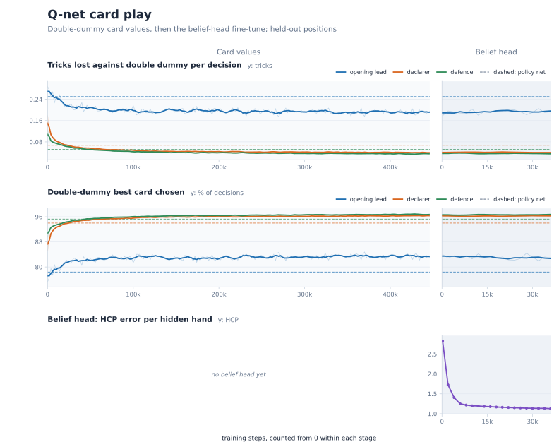

# Training curves

One figure per model, covering every training stage. Each stage gets its own
column. The step count restarts at 0 in each stage, and each stage starts from the
previous stage's weights. All numbers are validation or held-out measurements logged
during training, except the belief net's hand-summary loss, which comes from training
batches. Faint lines are the raw values. Where a thick line is drawn over a faint
one, it is a centred rolling mean over 3–5 logged points. A dashed vertical line
marks the released checkpoint.

## Pidgin V1 bidding



- **Contract score:** grounding takes the silent-opponent score from −514 (random
  weights) to about 100 points per deal within 4,000 steps. Own-contract self-play
  raises the four-seat own-contract score from 33 to 126 in its first 2,000 steps.
  By the end of the stage it reaches about 148.
- **Code words:** they climb from 3 to about 22 per 100 auctions during own-contract
  play. The simplicity cost brings them back to about 10.
- **Table score:** IMPs against the selection opponent go from −0.35 to +0.33 per
  board. Over the same steps the own-contract score drops from 147 to about 95, then
  recovers to about 118. The model accepts worse contracts for its own side when that
  costs the opponents more.
- **Competitive calls:** in the table-score stage, sacrifices fall from 4% of chances
  to almost none, and doubles rise from 2% to about 8%.

## Pidgin V2 bidding



- **Against Pidgin V1:** the grounding checkpoint starts at −3.7 IMPs per board.
  Treating failed contracts as doubled brings this to −0.4. Table play passes zero
  within 4,000 steps and reaches +0.29. The light-opening stage ends at +0.36 at the
  released step. Diamonds are 20,000-board matches against Pidgin V1 with a
  perfect-information doubler. These improve from −1.6 to about 0.
- **Contract score:** most of the own-contract score (33 → 118) comes in the first
  2,000 steps. After that it stays flat while IMPs keep improving.
- **Light openings:** table play pushes openings on 0–7 HCP hands from 2% to 30%. The
  light-opening cost brings them down to about 10% within 4,000 steps.
- **Code words:** they rise from 2 to about 7 per 100 auctions in the doubled-failures
  stage and settle at 9–12 after that.

## Belief net



- **Card owners:** full-auction cross-entropy on held-out auctions falls from 1.047 to
  1.037 nats per hidden card (random guessing is 1.099). Cards placed on the right
  player rise from 44.3% to 45.2%. Hiding the bidding systems costs about half a point.
- **Hand summaries:** the new summary head's loss drops from 6.1 to 3.6 nats within
  3,000 steps. Card placement dips briefly, then returns to its earlier level.
- **Bottom row:** the released model on 20,000 held-out auctions. Placement accuracy
  rises from 33% before any call to 46% after 15 calls. HCP error per hidden hand falls
  from 3.1 to 1.6. Aces are placed right 56–57% of the time and spot cards 42–44%. The
  defenders' view is 1–2 points better than the declaring side's.

## Policy net card play



- Measured on 19,970 held-out deals. The standard and wide networks follow the same
  path, and the wide one is slightly ahead throughout.
- **Self-play:** against random play, declarer gains go from 0 to 2.3–2.4 tricks per
  deal, and defence gains go from 0 to 1.75–1.8. Most of this happens in the first
  10,000 steps. With the net on all four seats, the shortfall against double dummy
  falls from 1.0 to 0.16–0.22 tricks per deal.
- **League:** the league fine-tune adds about 0.1 declarer tricks and lowers the
  double-dummy shortfall to 0.13–0.15.
- **Belief head:** hidden-card cross-entropy drops from 1.39 to about 0.60 nats within
  1,000 steps and stays there.

## Q-net card play



- **Card values:** tricks lost against double dummy per decision fall from 0.29 to 0.19
  on the opening lead, 0.18 to 0.04 for declarer, and 0.12 to 0.04 in defence. Dashed
  lines show the policy net on the same positions: 0.25, 0.07 and 0.05.
- **Best card:** the double-dummy best card is chosen on 83% of leads, 96% of declarer
  plays and 97% of defensive plays. The policy net's rates are 78%, 94% and 95%.
- **Belief head:** adding the belief head leaves card play unchanged. The head's HCP
  error per hidden hand falls from 2.8 to 1.1.

## Redraw the figures

[The numeric snapshot](data/training_curves.json) holds every plotted value, the stage
layout, and the panel settings. From the repository root, with Python 3.10 or newer:

```bash
python -m pip install matplotlib
python scripts/plot_training_curves.py
```

This writes five SVGs under `docs/figures/`. Add `--preview-dir /tmp/pidgin-curves`
for PNG previews.
